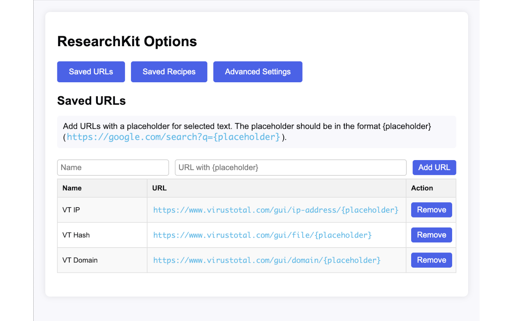
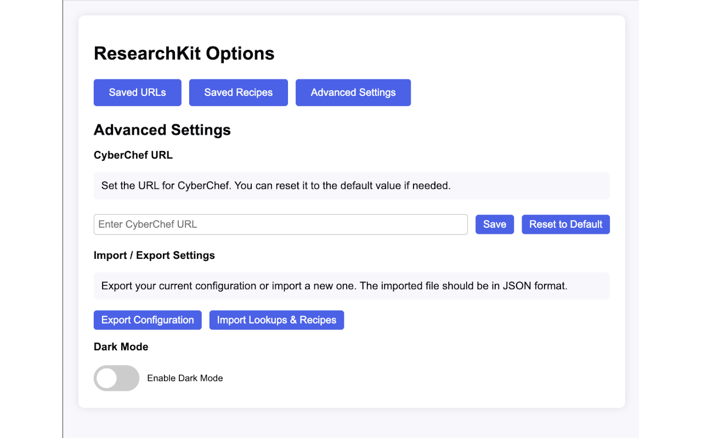
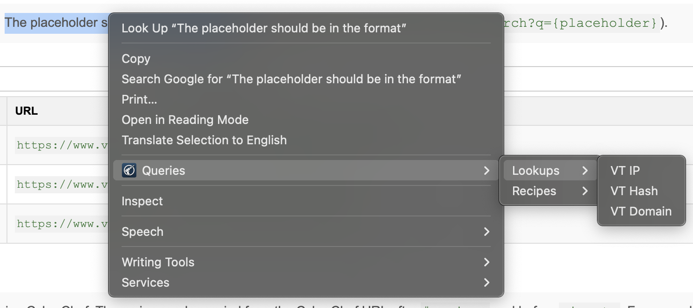

# ResearchKit Chrome Extension

This Chrome Extension is a bit of an exercise in "vibe coding." While I'm familiar with the structure and functionality of browser extensions, and with javascript, I'm a developer of neither. This project heavily relied on copilot for implementing functionality and - since I'm already using it - generating documentation including commit messages and the rest of this README file.

## Overview

ResearchKit is a customizable extension meant to streamline research workflows. Highlight text on a webpage and select from a list of lookups or CyberChef recipes. Example use cases:

- Look up IP addresses with a VirusTotal lookup
- Check domains with a Spamhaus lookup
- Decode data with a CyberChef recipe

## Features

- **Saved URLs**: Add and manage URLs with placeholders for selected text. Quickly open these URLs with the selected text in a new tab.
- **Saved Recipes**: Add and manage CyberChef recipes. Apply these recipes to selected text and open the result in CyberChef.
- **Custom CyberChef URL**: Set a custom URL for CyberChef or reset it to the default value.
- **Drag and Drop Reordering**: Easily reorder saved URLs and recipes using drag and drop functionality.
- **Context Menu Integration**: Access saved URLs and recipes directly from the context menu when text is selected.

## Installation

1. Clone the repository to your local machine.
2. Open Chrome and navigate to `chrome://extensions/`.
3. Enable "Developer mode" using the toggle in the top right corner.
4. Click "Load unpacked" and select the cloned repository folder.

## Usage

### Options Page

1. Open the extension options page by clicking on the extension icon and selecting "Options".
2. **Add URLs**: Enter a name and a URL with a `{placeholder}` for the selected text. Click "Add URL" or press Enter to save.
3. **Add Recipes**: Enter a name and a CyberChef recipe. Click "Add Recipe" or press Enter to save.
4. **Custom CyberChef URL**: Enter a custom URL for CyberChef and click "Save". Click "Reset to Default" to revert to the default URL.
5. **Reordering**: Drag and drop saved URLs and recipes to reorder them.

### Context Menu

1. Select text on any webpage.
2. Right-click to open the context menu.
3. Navigate to "Queries" and choose a saved URL or recipe to apply to the selected text.

## Screenshots

### Options Page

_Saved lookups / URLs_

_Saved CyberChef recipes_

_Advanced options page_

### Context Menu

_Context menu showing saved URLs and recipes._

## TODO

- **Administrative**
  - [ ] Publish beta version for testing changes before pushing to the main extension.
- **Functionality**
  - [ ] Add note property to saved lookup URLs and Recipes. This note won't be visible in the options page table, but if you click on the name will appear in an editable popup.
  - [ ] Allow the user to further organize saved lookup URLs and recipes. For example, under "Recipes" in the context menu, a custom menu named "Deobfuscate" that users can then assign specific recipes to appear under.
  - [ ] Persist saved settings across devices that the user is signed in to.
  - [x] Allow export and import of saved settings.
  - [ ] Change handling of CyberChef recipes so that they can be copied from the "Save Recipe" button rather than copying from the URL.
- **Style**
  - [ ] Prevent popup page from getting too long and use a scrollbar instead once it reaches a certain length.
  - [ ] It'd be good for the input field widths to align with the columns of the tables beneath them.
  - [ ] The CyberChef URL box appears to have shrunk, should be wider, maybe 50%?

## Contributing

Contributions are welcome! Please fork the repository and submit a pull request with your changes.

## License

This project is licensed under the MIT License. See the [LICENSE](LICENSE) file for details.
